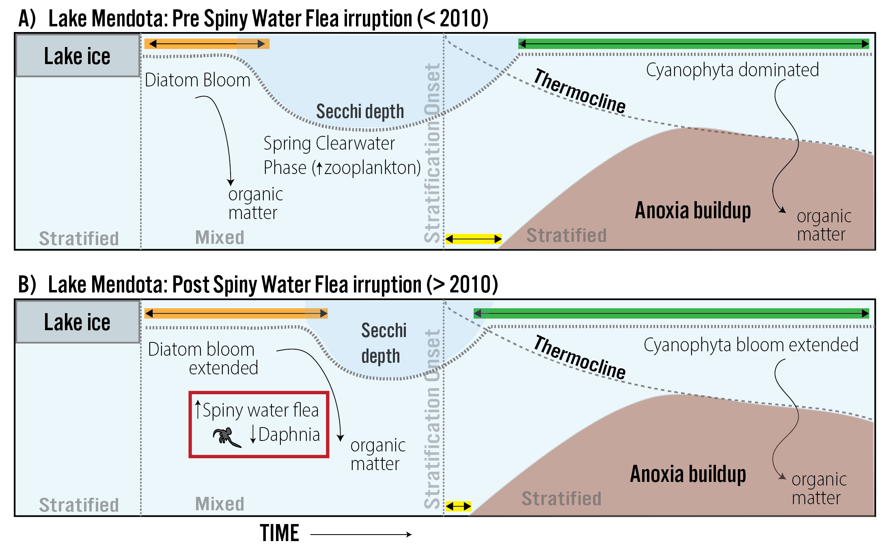

# Dataset: The aftermath of a trophic cascade: Increased anoxia following invasive species introduction in a eutrophic lake
R.R. Rohwer*, R. Ladwig*, H.A. Dugan, P.C. Hanson, J. Walsh & J.V. Zanden 

*Equally contributing first-authors

This repository includes the setup and output from the analysis ran on Lake Mendota to explore the trophic cascade caused by invasion of spiny water flea in 2010. Scripts to run the model are located under /src, and the processed results for the discussion of the paper are located under /data_processed. 

See also the data release at .

The figures are located under /figs_publications.

